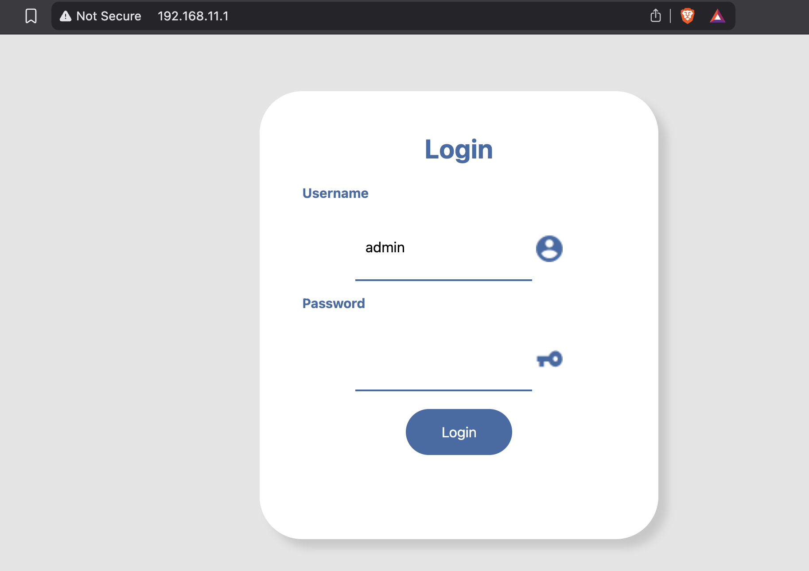
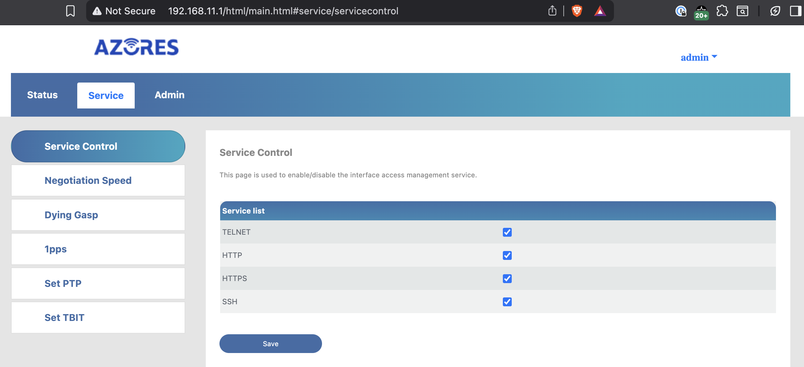
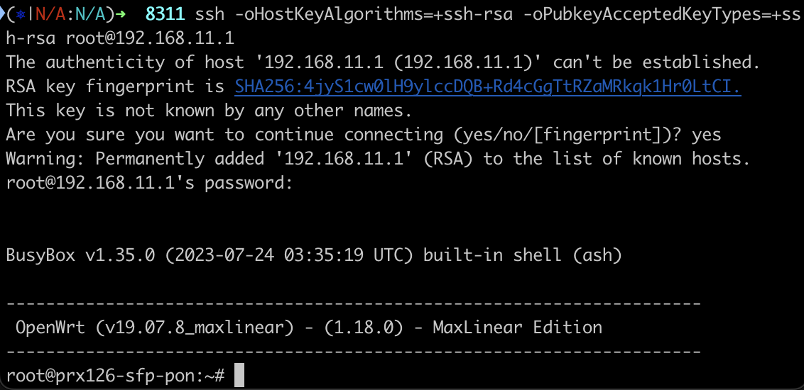

# Replacing QFiber ONT with XGS-PON

Recently, I decided to replace my QFiber ONT with an XGS-PON ONT to take advantage of the higher speeds and better performance. Below are the steps I followed to make this transition.

## Step 1: Gather Required Equipment

- QSFPTEK QT-10G-MC-NRJ45 10G SFP+ Slot Media Converter
- ECI Networks EN-XGSFPP-OMAC-V2 XGS-PON ONT

## Step 2: Enable SSH on the XGS-PON ONT

1. Install the XGS-PON ONT into the QSFPTEK QT-10G-MC-NRJ45 media converter.
2. Connect the media converter to your laptop or desktop via Ethernet.
3. Set a static IP on your laptop or desktop in the same subnet as the ONT.  Do not set a gateway or router address, in my case I was unable to accees the Internet over WiFi while configuring the ONT when I had configured one.
   - IP: 192.168.11.2
   - Subnet Mask: 255.255.255.0



4. Open a browser and connect to the XGS-PON ONT via the web interface. Below are the default credentials:
   - IP: 192.168.11.1
   - Default Username: admin
   - Default Password: QsCg@7249#5281

5. After logging in, navigate to the `Service` tab.  Click on `Service Control` and check the boxes for `Telnet` and `SSH`.  Click `Save` and then `Confirm`.



## Step 3: Connect via SSH and backup the existing firmware.

1. Read through this [Wiki](https://pon.wiki/guides/install-the-8311-community-firmware-on-the-was-110/) to understand the process of installing the community firmware.

2. Download the latest community firmware.

```bash
cd ~
mkdir 8311
cd 8311
curl -L --output-dir ~/8311 -O https://github.com/djGrrr/8311-was-110-firmware-builder/releases/download/v2.8.0/WAS-110_8311_firmware_mod_v2.8.0_basic.7z
```

3. Extract the firmware file.

```bash
brew install sevenzip
7zz e '-i!local-upgrade.*' ~/8311/WAS-110_8311_firmware_mod_v2.8.0_basic.7z -o/tmp
```

4. Connect to the XGS-PON ONT via SSH.
  - Default Username: root
  - Default Password: QpZm@4246#5753

```bash
ssh -oHostKeyAlgorithms=+ssh-rsa -oPubkeyAcceptedKeyTypes=+ssh-rsa root@192.168.11.1
```



5. Backup the existing firmware.

```bash
mkdir -p /tmp/fw; for part in kernelA bootcoreA rootfsA kernelB bootcoreB rootfsB; do VOL=$(ubinfo /dev/ubi0 -N "$part" | grep "Volume ID" | awk '{print $3}'); [ -n "$VOL" ] && { DEV="/dev/ubi0_$VOL"; OUT="/tmp/fw/ubi0_$VOL-$part.img"; echo "Dumping $part ($DEV) to: $OUT"; dd if="$DEV" of="$OUT"; }; done; exit
```


## References
- [Fiber Optic Association: FTTH PON](https://www.thefoa.org/tech/ref/appln/FTTH-PON-HFC-To_PON.html)
- [OptCore: What is XGS-PON?](https://www.optcore.com/what-is-xgs-pon/)
- [8311 Discord Channel](https://discord.com/servers/8311-886329492438671420)
- [ECI Networks: FAQ: EN-XGSFPP-OMAC-V2](https://helpdesk.ecin.ca/xgs-pon)
- [ECI Networks: XGS-PON ONT](https://ecin.ca/custom-xgs-pon-sfp-stick-module-xgspon-ont-w-t-mac-function-mounted-on-sfp-package/)
`