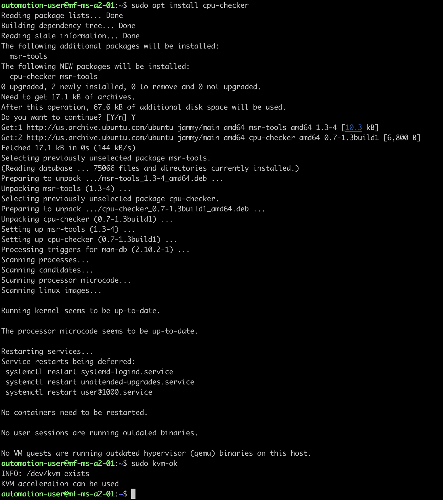
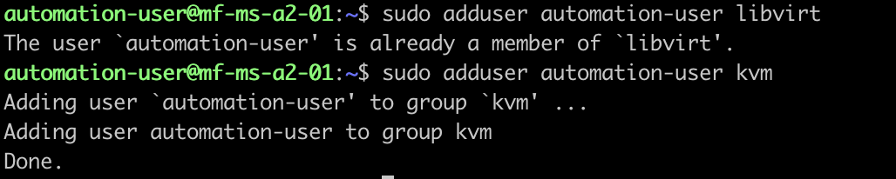
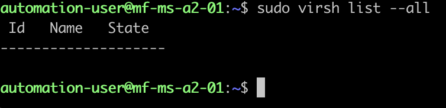
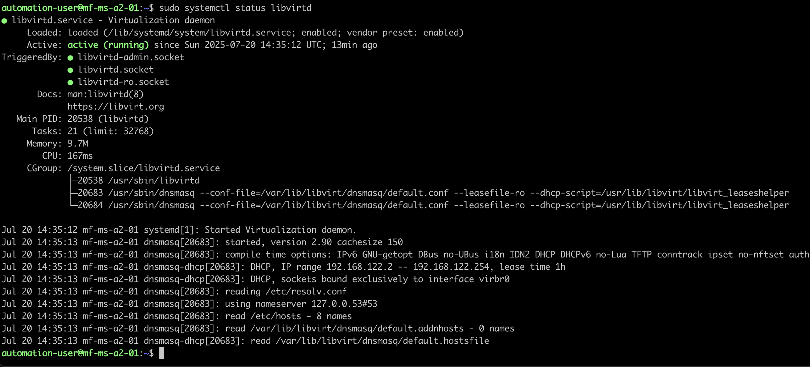

# KVM Virtualized Self-Hosted Controlplane

In this section, we will cover how to set up a KVM virtualized self-hosted control plane using Private Cloud Director (PCD) with a custom domain and Single Sign-On (SSO) integration.

## Install Ubuntu Server 22.04

### Hostname

mf-ms-a2-01

### bond0

| Field            | Value               |
|------------------|---------------------|
| Interfaces       | enp5s0f0, enp5s0f1  |
| Bond Mode        | 802.3ad (LACP)      |
| XMIT Hash Policy | Layer 2+3           |
| LACP Rate        | fast                |
| IPv6 Method      | DHCPv6 Automatic    |
| IPv4 Method      | Disabled            |

### bond0.61

| Field          | Value                         |
|----------------|-------------------------------|
| IPv6 Method    | Disabled                      |
| IPv4 Method    | Manual                        |
| VLAN ID        | 61                            |
| Subnet         | 10.5.0.0/16                   |
| IPv4 Address   | 10.5.176.1                    |
| Gateway        | 10.5.0.1                      |
| DNS Servers    | 10.5.0.1,1.1.1.1,8.8.8.8      |
| Search Domains | rye.ninja,usmnblm01.rye.ninja |

### bond0.5

| Field          | Value                         |
|----------------|-------------------------------|
| IPv6 Method    | Disabled                      |
| IPv4 Method    | Manual                        |
| VLAN ID        | 5                             |
| Subnet         | 10.6.0.0/24                   |
| IPv4 Address   | 10.6.0.150                    |
| Gateway        | N/A                           |
| DNS Servers    | N/A                           |
| Search Domains | N/A                           |

### Enable Passwordless Sudo

```bash
sudo cat <<EOF > /etc/sudoers.d/automation-user
automation ALL=(ALL:ALL) NOPASSWD:ALL
EOF
```

## Check if the Host can run KVM

### Update and Upgrade all the packages currently installed.

```bash
sudo apt update && sudo apt upgrade -y
```

### Checking for Hardware Virtualization Support

This command will check if your cpu supports hardware virtualization.  It returns the number of CPU cores that support hardware virtualization. If the output is greater than 0, then your CPU supports hardware virtualization.

```bash
egrep -c '(vmx|svm)' /proc/cpuinfo
```


### Checking for KVM Acceleration Support

The next commands will install the `cpu-checker` package and verify if you can use KVM acceleration.

```bash
sudo apt install cpu-checker
sudo kvm-ok
```



## Install KVM and Required Packages

### Install the required packages for KVM and virtualization.

Install the essential KVM packages with the following command:

```bash
sudo apt install qemu-kvm libvirt-daemon-system libvirt-clients bridge-utils uvtool
```

Here is an explanation of the tools (packages):

| Tool               | Description                                                                 |
|--------------------|-----------------------------------------------------------------------------------------------------------------|
| qemu               | A generic and open source machine emulator and virtualizer.                                                          |
| qemu-kvm           | The main KVM package that provides the kernel-based virtual machine functionality.                                      |
| libvirt-daemon     | The virtualization daemon that manages the virtualization capabilities of the host system.                                           |
| libvirt-clients    | A package that contains various client tools for managing virtualization, such as `virsh`.                                 |
| bridge-utils       | A tool that allows users to create and manage network bridges, which are essential for networking in virtual machines. |
| openvswitch-switch | A software-defined networking solution that provides advanced networking capabilities for virtual machines.            |
| uvtool             | Ubuntu virtualisation front-end for libvirt and KVM.                                                              |

Additional packages that are useful for managing KVM virtual machines in a desktop environment, but that I did not install because this is a headless server.

| Tool               | Description                                                                 |
|--------------------|-----------------------------------------------------------------------------------------------------------------|
| virt-manager       | A graphical interface for managing virtual machines. This is not installed on a headless server, but can be installed on a desktop machine to manage the KVM host. |

### Authorize users to use KVM

1. Add the user to the `libvirt` group to allow them to manage KVM virtual machines.

```bash
sudo adduser automation-user libvirt
```

2. Next, do the same for the `kvm` group.

```bash
sudo adduser automation-user kvm
```



### Verify KVM Installation

Confirm that the KVM installation was successful with the virsh command. The virsh command is a command-line tool for managing virtual machines on Linux systems. Run the command below:

```bash
virsh list --all
```

The command lists all active and inactive virtual machines on the system. You can expect an output similar to the one below if you have not yet created any VMs:



Alternatively, use the systemctl command to check the status of libvirtd, the daemon that provides the backend services for the libvirt virtualization management system:

```bash
sudo systemctl status libvirtd
```



If the virtualization daemon is not active, activate it with the following command:

```bash
sudo systemctl enable --now libvirtd
```

## Provisioning the KVM Bridge Network

### The "default" Network

When libvirt is in use and the libvirtd daemon is running, a default network is created. We can verify that this network exists by using the virsh utility, which on the majority of Linux distribution usually comes with the libvirt-client package. To invoke the utility so that it displays all the available virtual networks, we should include the `net-list` subcommand:

```bash
sudo virsh net-list --all
```

In the example above we used the --all option to make sure also the inactive networks are included in the result, which should normally correspond to the one displayed below:

```
 Name      State    Autostart   Persistent
--------------------------------------------
 default   active   yes         yes
 ```

### Create the Bridge Networks

To create the bridge networks, we will use the Netplan configuration tool. Netplan is a utility for easily configuring networking on Ubuntu systems. It uses YAML files to define network configurations.  By default, the Netplan configuration will be located in `/etc/netplan/50-cloud-init.yaml`.  One challenge with this file is that it is automatically generated by the cloud-init service, so any changes made to this file will be overwritten on the next boot.  To prevent this, we will disable this behavior by creating a new file `/etc/cloud/cloud.cfg.d/99-disable-network-config.cfg` with the following content:

```yaml
network:
  config: disabled
```

Replace the configuration in the `/etc/netplan/50-cloud-init.yaml` file with the following to create the bridge networks.  This configuration assumes you have already created the `bond0` interface as described above.

```yaml
network:
    bonds:
        bond0:
            interfaces:
            - enp5s0f0
            - enp5s0f1
            parameters:
                lacp-rate: fast
                mode: 802.3ad
                transmit-hash-policy: layer2+3
    ethernets:
        enp5s0f0: {}
        enp5s0f1: {}
    version: 2
    bridges:
        br0:
            dhcp6: true
            interfaces:
            - bond0
        br5:
            addresses:
            - 10.6.0.150/24
            nameservers:
                addresses: []
                search: []
            interfaces:
            - bond0.5
        br61:
            addresses:
            - 10.5.176.1/16
            nameservers:
                addresses:
                - 10.5.0.1
                - 1.1.1.1
                - 8.8.8.8
                search:
                - rye.ninja
                - usmnblm01.rye.ninja
            routes:
            -   to: default
                via: 10.5.0.1
            interfaces:
            - bond0.61
    vlans:
        bond0.5:
            id: 5
            link: bond0
        bond0.61:
            id: 61
            link: bond0
    wifis: {}
```


## Creating KVM Virtual Machines to host Self-Hosted PCD Controlplane

In this section, we will cover how to create KVM virtual machines to host a self-hosted Private Cloud Director (PCD) control plane.  We'll start by provisioning a set of thin-provisioned disks for the VMs, then create the VMs and prepare Ubuntu Server 22.04 for PCD installation.

### Get the Ubuntu cloud image with uvt-simplestreams-libvirt

This is one of the major simplifications that uvtool provides. It knows where to find the cloud images so you only need one command to get a new cloud image. For instance, if you want to synchronise all cloud images for the amd64 architecture, the uvtool command would be:

```bash
sudo uvt-simplestreams-libvirt --verbose sync arch=amd64 release=jammy
```

After all the images have been downloaded from the Internet, you will have a complete set of locally-stored cloud images. To see what has been downloaded, use the following command:

```bash
sudo uvt-simplestreams-libvirt query
```

### Create a Valid SSH Key

To connect to the virtual machine once it has been created, you must first have a valid SSH key available for the Ubuntu user. If your environment does not have an SSH key, you can create one using the ssh-keygen command, which will produce similar output to this:

```bash
mkdir -p ~/.ssh
ssh-keygen -t rsa -b 4096 -C "your_email@example.com" -N "" -f ~/.ssh/id_rsa
```

### Creating KVM Virtual Machines with uvt-kvm

Now that we have the disk images ready, we can create the KVM virtual machines using the `virt-install` command. We'll create three VMs for the PCD control plane.

```bash
# Create the first VM
sudo uvt-kvm create \
  --ssh-public-key-file ~/.ssh/id_rsa.pub \
  --memory 28672 \
  --disk 250 \
  --cpu 14 \
  --bridge br61 \
  --password SuperSecretPassword \
  pcd-controlplane-1 \
  release=jammy arch=amd64

  # --network bridge=br61,model=virtio,mac=la:b0:00:00:02 \
  # --network bridge=br5,model=virtio,mac=la:b0:00:00:03 \

```

### Installing kcli for managing virtual machines

[kcli Documentation](https://kcli.readthedocs.io/en/latest)
[kcli Sample Config](https://github.com/karmab/kcli/blob/main/samples/config.yml)

```bash
curl https://raw.githubusercontent.com/karmab/kcli/main/install.sh | sudo bash
sudo kcli create pool -p /var/lib/kcli/images kcli
sudo chgrp libvirt /var/lib/kcli/images/
sudo chmod g+w /var/lib/kcli/images/
sudo setfacl -m u:$(id -un):rwx /var/lib/libvirt/images
cat > ~/.kcli/config.yml << EOF
default:
  autostart: false
  client: local
  cloudinit: true
  cpuhotplug: false
  cpumodel: host-model
  diskinterface: virtio
  disks:
  - default: true
    size: 80
  disksize: 80
  diskthin: true
  enableroot: true
  guestagent: true
  memory: 4096
  memoryhotplug: false
  nested: true
  nets:
  - br0
  networkwait: 0
  numcpus: 2
  start: true
  tpm: false
  vmrules_strict: false
  vnc: true
  wait: false
  waittimeout: 0
local:
  host: 127.0.0.1
  pool: kcli
  protocol: ssh
  type: kvm
  user: automation-user
EOF
kcli list available-imageskcli list available-images
kcli download image ubuntu2204
kcli create vm -i ubuntu2204 vm1
kcli ssh vm1
kcli delete vm1
kcli create confpool k3s-cluster-contorlplane -P ips=[2607:AAAA:BBBB:CCC::100,2607:AAAA:BBBB:CCC::101,2607:AAAA:BBBB:CCC::102] -P netmask=64 -P gateway
kcli create confpool k3s-cluster -P ips=[2607:AAAA:BBBB:CCC::100,2607:AAAA:BBBB:CCC::101,2607:AAAA:BBBB:CCC::102,2607:AAAA:BBBB:CCC::200,2607:AAAA:BBBB:CCC::201,2607:AAAA:BBBB:CCC::202] -P
```

## Installing NetData for Monitoring

To install NetData on the KVM Host for monitoring, follow these steps:

```bash
export CLAIM_TOKEN=`op read --account ryefamily.1password.com op://Home_Lab/netdata-claim-token/credential`
export ROOM_TOKEN=`op read --account ryefamily.1password.com op://Home_Lab/netdata-claim-token/roomid_usmnblm01.rye.ninja`

curl https://get.netdata.cloud/kickstart.sh > /tmp/netdata-kickstart.sh && sh /tmp/netdata-kickstart.sh --stable-channel --claim-token ${CLAIM_TOKEN} --claim-rooms ${ROOM_ID}$ --claim-url https://app.netdata.cloud
```


## Using Private Cloud Director with a Custom Domain and SSO

Installing PCD with a custom domain is a straightforward process. Below are the steps to set up PCD with your own domain.

### Install with a custom domain

```bash
export DU_FQDN=pcd.usmnblm01.rye.ninja
export REGION_NAME=local
curl -sfL https://go.pcd.run | bash
```

### Configure JumpCloud SSO Application

1. Log in to the JumpCloud Admin Portal.
2. Navigate to `SSO Applications` in the left sidebar.
3. Click `Add New Application`.
4. Click `Select` under `Custom Application`.
5. Click `Next`.
6. Select `Manage Single Sign-on (SAML)`.
7. Select `Configure SSO with SAML`.
8. Click `Next`.
9. Set `Display Label` to `PCD Community`.
10. Click `Save Application`.
11. Click `Configure Application`.
12. Use `JumpCloud` as the `IDP Entity ID`.
13. Set `SP Entity ID` to `https://pcd-local.usmnblm01.rye.ninja/keystone`.
14. Add the following `ACS URLs`:
    - `https://pcd-local.usmnblm01.rye.ninja/Shibboleth.sso/IDP1/SAML2/POST`
    - `https://pcd.usmnblm01.rye.ninja/Shibboleth.sso/IDP1/SAML2/POST`
15. Set `SAML Subject NameID` to `email`.
16. Set `SAML Subject NameID Format` to `urn:oasis:names:tc:SAML:1.0:nameid-format:unspecified`.
17. Set `Signature Algorithm` to `RSA-SHA256`.
18. Set `Login URL` to `https://pcd-local.usmnblm01.rye.ninja/ui/login`.
19. Set `IDP URL` to `https://sso.jumpcloud.com/saml2/pcd-community`.
20. Add the following attribute mappings:
    - `FirstName` to `firstname`
    - `LastName` to `lastname`
    - `Email` to `email`
    - `Department` to `department`
21. Check the box for `Include Group Attribute`.
23. Use `memberOf` as the `Group Attribute Name`.
24. Click `Save`.
25. Click `Copy Metadata URL` to for later use.

### Configure SAML SSO with JumpCloud

1. Log in to the Private Cloud Director (PCD) web interface.
2. Click the Gear icon in the top right corner to access the settings menu.
3. Click `Enterprise SSO`.
4. Click `SSO`
5. Click `Enable SSO`.
6. Select `Other` for `SSO Provider`.
7. Use `JumpCloud` as the `SSO Provider Name`.
8. Use `JumpCloud` as the `Entity ID`.
9. Paste the `Metadata URL` you copied from JumpCloud into the `SAML Metadata URL` field.
10. Use the following entity mapping XML for the `SSO Provider Attribute Map in XML`.

```xml
<Attributes xmlns="urn:mace:shibboleth:2.0:attribute-map" xmlns:xsi="http://www.w3.org/2001/XMLSchema-instance">
  <Attribute id="FirstName" name="FirstName" nameFormat="urn:oasis:names:tc:SAML:2.0:attrname-format:unspecified">
    <AttributeDecoder caseSensitive="false" xsi:type="StringAttributeDecoder"/>
  </Attribute>
  <Attribute id="LastName" name="LastName" nameFormat="urn:oasis:names:tc:SAML:2.0:attrname-format:unspecified">
    <AttributeDecoder caseSensitive="false" xsi:type="StringAttributeDecoder"/>
  </Attribute>
  <Attribute id="Email" name="Email" nameFormat="urn:oasis:names:tc:SAML:2.0:attrname-format:unspecified">
    <AttributeDecoder caseSensitive="false" xsi:type="StringAttributeDecoder"/>
  </Attribute>
  <Attribute id="Department" name="Department" nameFormat="urn:oasis:names:tc:SAML:2.0:attrname-format:unspecified">
    <AttributeDecoder caseSensitive="false" xsi:type="StringAttributeDecoder"/>
  </Attribute>
  <Attribute id="memberOf" name="memberOf" nameFormat="urn:oasis:names:tc:SAML:2.0:attrname-format:unspecified">
    <AttributeDecoder caseSensitive="false" xsi:type="StringAttributeDecoder"/>
  </Attribute>
</Attributes>
```

### Configure SSO Group Mappings in PCD


1. Log in to the Private Cloud Director (PCD) web interface.
2. Click the Gear icon in the top right corner to access the settings menu.
3. Click `Enterprise SSO`.
4. Click `SAML Groups`.
5. Click `New Group`.
6. Use `pcd-admin` as the `Name`.
7. Use `PCD Administrators` as the `Description`.
8. Use `FirstName` for `SAML Attribute Key for a User's First Name`.
9. Use `LastName` for `SAML Attribute Key for a User's Last Name`.
10. Use `Email` for `SAML Attribute Key for a User's Email`.
11. Click `Add Group Mapping`.
12. Use `memberOf` for `SAML Group Attribure`.
13. Use `ACL_PCD_Administrators` for `SAML Group Values`.
14. Check the box next to `service` in `Tenants & Roles`.
15. Select `Administrator` for the `Roles` for tenant `service`.
16. Click `Add Group`.


## References

### KVM Resources
- [Liquid Web: Setting up a KVM on Ubuntu for virtualization](https://www.liquidweb.com/blog/how-to-set-up-virtualization-host-using-kvm-ubuntu/)
- [Beam Networks: Manually Create QEMU Disk](https://docs.beamnetworks.dev/en/kvm/qemu/manually-create-disk)
- [Beam Networks: Creating a VM with KVM: Step-by-Step Tutorial on Ubuntu](https://docs.beamnetworks.dev/en/kvm/create-vm-full)
- [YouTube: Beam Networks: Creating a VM with KVM: Step-by-Step Tutorial on Ubuntu](https://www.youtube.com/watch?v=_X1imTzohsY)
- [PhoenixNap: How to Install KVM on Ubuntu](https://phoenixnap.com/kb/ubuntu-install-kvm)
- [Vivek Gite: How to use KVM cloud images on Ubuntu Linux](https://www.cyberciti.biz/faq/how-to-use-kvm-cloud-images-on-ubuntu-linux/)
- [Ubuntu: Create Cloud Image VMs with UVtool](https://documentation.ubuntu.com/server/how-to/virtualisation/cloud-image-vms-with-uvtool/index.html)
- [Ubuntu Manuals: uvt-kvm](https://manpages.ubuntu.com/manpages/jammy/en/man1/uvt-kvm.1.html)
- [Ubuntu Manuals: uvt-simplestreams-libvirt](https://manpages.ubuntu.com/manpages/jammy/en/man1/uvt-simplestreams-libvirt.1.html)
- [LinuxConfig: How to Use Bridged Networking with Libvirt and KVM](https://linuxconfig.org/how-to-use-bridged-networking-with-libvirt-and-kvm)
- [YouTube: Open vSwitch: Integrating Open vSwitch with Netplan.io](https://www.youtube.com/watch?v=Wyr9sE76fH8)
- [YouTube: Open vSwitch: Integrating Open vSwitch with Netplan.io (slides)](https://docs.google.com/presentation/d/e/2PACX-1vTg8TOaS6WXgvGhpRxuGUJ_XDQBeRjLkvd8yppLWqm-TmKK99NhWHcN-QTl0rSRnosjg0nMydlFm6Ke/pub?slide=id.g658852891d_0_10)
- [Netplan Documentation: How to configure network bridges](https://netplan.readthedocs.io/en/stable/examples/#how-to-configure-network-bridges)

### LVM Resources
- [NetworkLessons.con: How to Extend Linux LVM Logical Volume](https://networklessons.com/miscellaneous/extend-lvm-partition)

### SR-IOV Resources
- [Intel: Configure SR-IOV Network Virtual Functions in Linux KVM](https://www.intel.com/content/www/us/en/developer/articles/technical/configure-sr-iov-network-virtual-functions-in-linux-kvm.html)